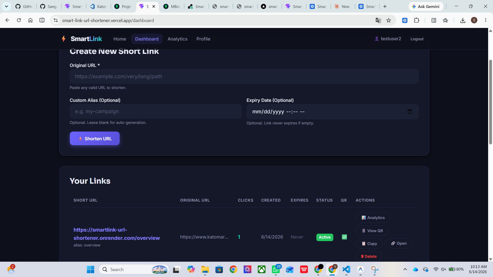
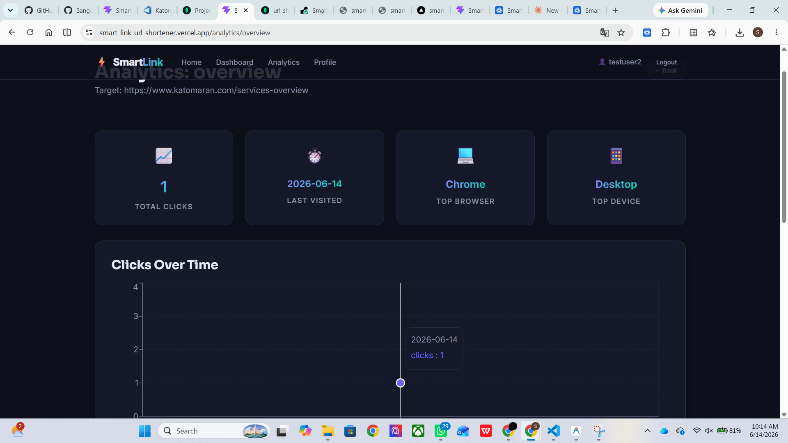
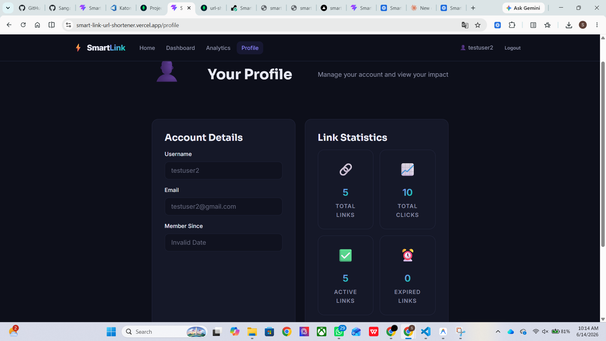
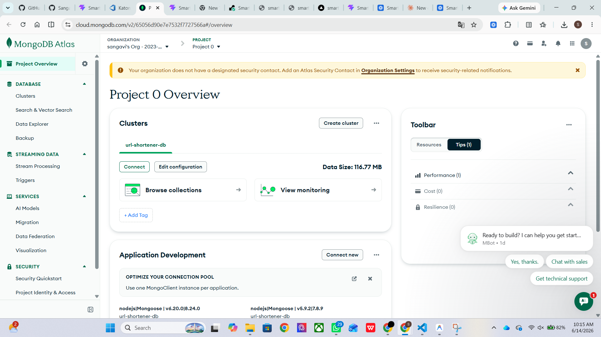
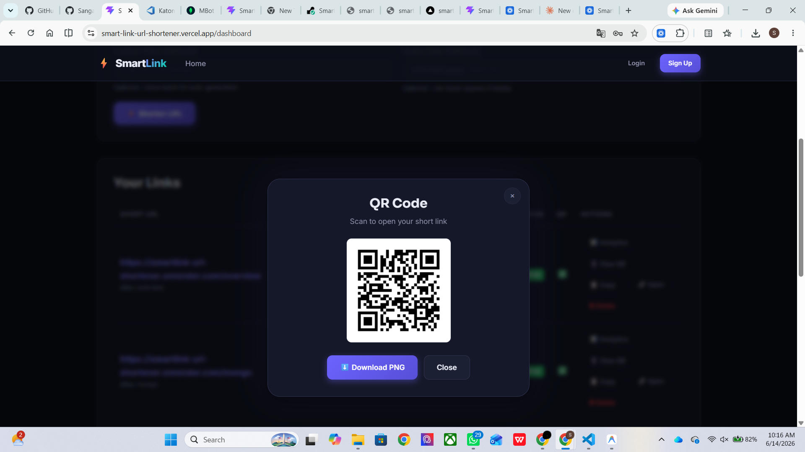

# SmartLink URL Shortener with Analytics

## 🚀 Live Demo

### Frontend (Vercel)
https://smart-link-url-shortener.vercel.app

### Backend (Render)
https://smartlink-url-shortener.onrender.com

---

## 🎥 Demo Video

Loom Walkthrough:

https://www.loom.com/share/043d8e9769404559a20398c411186486

---

# 📌 Project Overview

SmartLink is a full-stack URL Shortener and Analytics platform that enables users to create, manage, and track shortened URLs through an intuitive dashboard.

The platform provides:

- Secure User Authentication
- URL Shortening
- Custom Aliases
- Link Expiry Management
- QR Code Generation
- Click Tracking Analytics
- Browser & Device Insights
- Bulk CSV Upload
- Profile Dashboard
- Public Analytics

---

# 📸 Screenshots

## Dashboard



## Analytics



## Profile



## MongoDB Database



## QR Code



---

# 🤖 AI Usage Report

This project was developed using AI-assisted planning and implementation support.

AI assistance was used for:

- Architecture planning
- Backend API design
- MongoDB schema design
- Authentication workflow planning
- Analytics aggregation logic
- Deployment guidance
- README documentation

All implementation, testing, debugging, deployment, and final integration were completed and verified manually.

---

# 🏗️ Architecture Diagram

```text
┌─────────────────────┐
│     React + Vite    │
│      Frontend       │
└──────────┬──────────┘
           │ REST API
           ▼
┌─────────────────────┐
│   Express.js API    │
│ Authentication      │
│ URL Services        │
│ Analytics Engine    │
└──────────┬──────────┘
           │
           ▼
┌─────────────────────┐
│      MongoDB        │
│ users collection    │
│ urls collection     │
│ clicks collection   │
└─────────────────────┘
```

---

# 🛠️ Technology Stack

## Frontend

- React.js
- Vite
- React Router DOM
- Axios
- Recharts
- CSS3

## Backend

- Node.js
- Express.js
- MongoDB Atlas
- Mongoose
- JWT Authentication
- bcryptjs
- Multer
- csv-parser
- QRCode

## Deployment

- Vercel (Frontend)
- Render (Backend)
- MongoDB Atlas (Database)

---

# ✨ Features

## 🔐 Authentication

- User Registration
- User Login
- JWT Authentication
- Protected Routes

## 🔗 URL Management

- Generate Short URLs
- Custom Aliases
- URL Expiration
- Delete URLs
- Copy URLs

## 📊 Analytics Dashboard

- Total Click Tracking
- Click Timeline
- Browser Analytics
- Device Analytics
- Referrer Tracking
- Public Statistics

## 📱 QR Code Generation

- Automatic QR Code Creation
- Download QR as PNG
- Open Short Link via QR

## 📂 Bulk Upload

- CSV File Upload
- Batch URL Shortening

## 👤 Profile Dashboard

- User Details
- Total Links
- Total Clicks
- Active Links
- Expired Links

---

# 📋 Assumptions

- Users must be authenticated to create and manage URLs.
- MongoDB Atlas is used as the primary database.
- Analytics are collected from redirect requests.
- Device and browser information are extracted from User-Agent headers.
- CSV uploads contain valid URLs.
- Environment variables are configured before deployment.
- Internet access is available for analytics collection and redirection.

---

# 🚀 Installation Guide

## Clone Repository

```bash
git clone <your-github-repository-url>
cd SmartLink-URL-Shortener
```

## Backend Setup

```bash
cd server
npm install
npm run dev
```

## Frontend Setup

```bash
cd client
npm install
npm run dev
```

---

# ⚙️ Environment Variables

## Backend (.env)

```env
PORT=5001

NODE_ENV=development

MONGO_URI=your_mongodb_connection_string

JWT_SECRET=your_secret_key

JWT_EXPIRE=30d

BASE_URL=https://smartlink-url-shortener.onrender.com
```

## Frontend (.env)

```env
VITE_API_URL=https://smartlink-url-shortener.onrender.com/api/v1
```

---

# 📡 API Documentation

| Method | Endpoint | Description | Access |
|----------|----------|----------|----------|
| POST | /api/v1/auth/register | Register User | Public |
| POST | /api/v1/auth/login | Login User | Public |
| GET | /api/v1/auth/me | Get Current User | Private |
| POST | /api/v1/urls | Create URL | Private |
| GET | /api/v1/urls | Get User URLs | Private |
| PUT | /api/v1/urls/:id | Update URL | Private |
| DELETE | /api/v1/urls/:id | Delete URL | Private |
| POST | /api/v1/urls/bulk-upload | Bulk Upload URLs | Private |
| GET | /api/v1/analytics/:shortCode | Private Analytics | Private |
| GET | /api/v1/public/:shortCode | Public Analytics | Public |
| GET | /:shortCode | Redirect URL | Public |

---

# 📁 Project Structure

```text
SmartLink-URL-Shortener
│
├── screenshots/
│   ├── dashboard.png
│   ├── analytics.png
│   ├── profile.png
│   ├── mongodb.png
│   └── qr-code.png
│
├── client/
│   ├── src/
│   │   ├── components/
│   │   ├── hooks/
│   │   ├── pages/
│   │   ├── services/
│   │   └── App.jsx
│   │
│   └── package.json
│
├── server/
│   ├── config/
│   ├── controllers/
│   ├── middleware/
│   ├── models/
│   ├── routes/
│   └── index.js
│
└── README.md
```

---

# 🧪 Testing Performed

### Authentication

✅ Registration

✅ Login

✅ Protected Routes

### URL Features

✅ URL Creation

✅ URL Redirection

✅ Custom Alias

✅ Expiry Validation

### Analytics

✅ Click Tracking

✅ Analytics Dashboard

✅ Browser Detection

✅ Device Detection

### Additional Features

✅ QR Code Generation

✅ QR Download

✅ CSV Upload

✅ Profile Statistics

### Deployment

✅ Frontend Deployment

✅ Backend Deployment

✅ MongoDB Integration

---

# 📈 Future Improvements

- Custom Domains
- Analytics Export (CSV/PDF)
- Password Reset
- Email Verification
- Team Collaboration
- A/B Testing
- Webhooks
- Advanced Analytics Filters

---

# 📄 License

This project is licensed under the MIT License.

---

## 👨‍💻 Author

Developed as part of the SmartLink URL Shortener Hackathon Project.

---

This project is a part of a hackathon run by https://katomaran.com